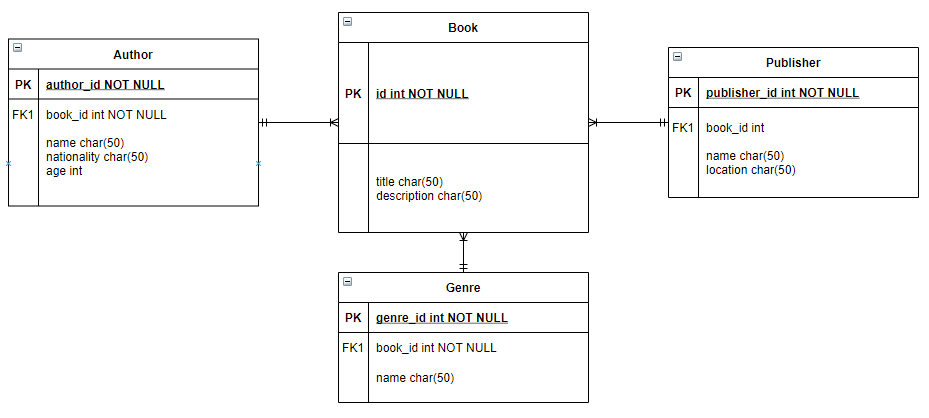

# JAVA SPRING BOOT CHALLENGE

### EXERCISE OVERVIEW
Java Spring Boot is taught in General Assembly's Java programs. Here's an opportunity to show off your core Java and Spring Boot skills in this code challenge. You will be building a Spring Boot REST API with a few requirements for this instructor challenge.

### DELIVERABLE
For this instructor challenge, you will be creating a `book API` that performs full CRUD. 

### REQUIREMENTS

There are 4 tables :

- Book
- Author
- Publisher
- Genre

Given the following ERD diagram, construct the endpoints below.



### ENDPOINTS

| Endpoint                   | Functionality            | Access |
|----------------------------|--------------------------| --- |
| GET /api/books             | Get all Books            | PUBLIC |
| GET /api/books/1           | Get Single Book   		| PUBLIC |
| POST /api/books            | Creating a Single Book   | PUBLIC |
| PUT /api/books/1           | Updating Single Book     | PUBLIC |
| DELETE /api/books/1        | Delete Single Book       | PUBLIC |
| GET /api/authors/1/books   | Get all the books belongs to an author | PUBLIC |
| GET /api/genre/1/books   | Get all the books by genre  | PUBLIC |
| GET /api/publisher/1/authors   | Get all the authors and books that belongs to the publisher  | PUBLIC |

Your code should be clear and understandable, since your student facing code should be beginner friendly! Include comments briefly explaining your thought process and your code.


### DEPENDENCIES

The following dependencies are listed in the `POM.xml` file.
```xml
<dependencies>
    <dependency>
        <groupId>org.springframework.boot</groupId>
        <artifactId>spring-boot-starter</artifactId>
    </dependency>
    <dependency>
        <groupId>org.springframework.boot</groupId>
        <artifactId>spring-boot-devtools</artifactId>
        <scope>runtime</scope>
        <optional>true</optional>
    </dependency>
    <dependency>
        <groupId>org.springframework.boot</groupId>
        <artifactId>spring-boot-starter-test</artifactId>
        <scope>test</scope>
    </dependency>
    <dependency>
        <groupId>org.springframework.boot</groupId>
        <artifactId>spring-boot-starter-web</artifactId>
    </dependency>
    <dependency>
        <groupId>org.springframework.boot</groupId>
        <artifactId>spring-boot-starter-data-jpa</artifactId>
    </dependency>
    <dependency>
        <groupId>org.postgresql</groupId>
        <artifactId>postgresql</artifactId>
        <scope>runtime</scope>
    </dependency>
</dependencies>
```

### INITIAL PROJECT SETUP

- Fork and clone the repository.
- Use Postgres or any other DB manager to create a database called `bookstore`.
- Open `src/main/resources/application-dev.properties` and add your `username`/`password` if applicable.
- You can change the default port from `9090` to any of your choosing.
- Run the application. Type `http://localhost:9090/helloworld` and that should be an indication if the application is
  working.

### GENERAL APPROACH YOU SHOULD TAKE WHILE BUILDING THIS API

- All the URL mapping should be under the `controller` package.
- All the database models should reside inside the `models` package.
- You should use the `repository` package to use predefined methods from JPARepository interface. You may use the
  same `interface` for the custom methods, which aren’t included inside JPA.
- All the business logic should go under the `service` package, later on endpoints inside the `controller` can call these
  business logic accordingly.
- The `exception` package contains the custom classes to handle `HTTP` errors such as `HttpStatus.CONFLICT`
  and `HttpStatus.NOT_FOUND`. You should utilize these classes when fetching data from the DB.
